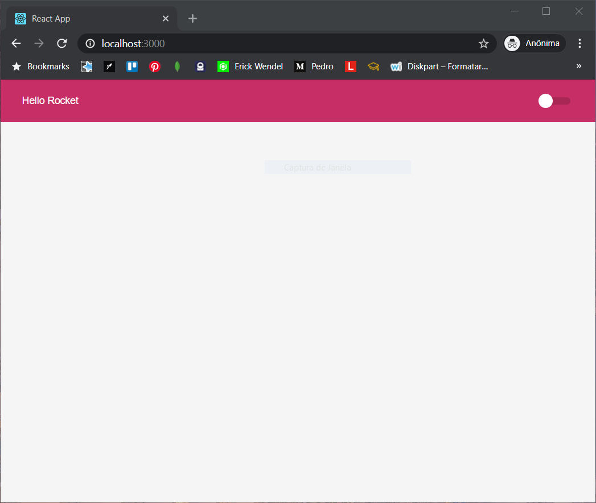
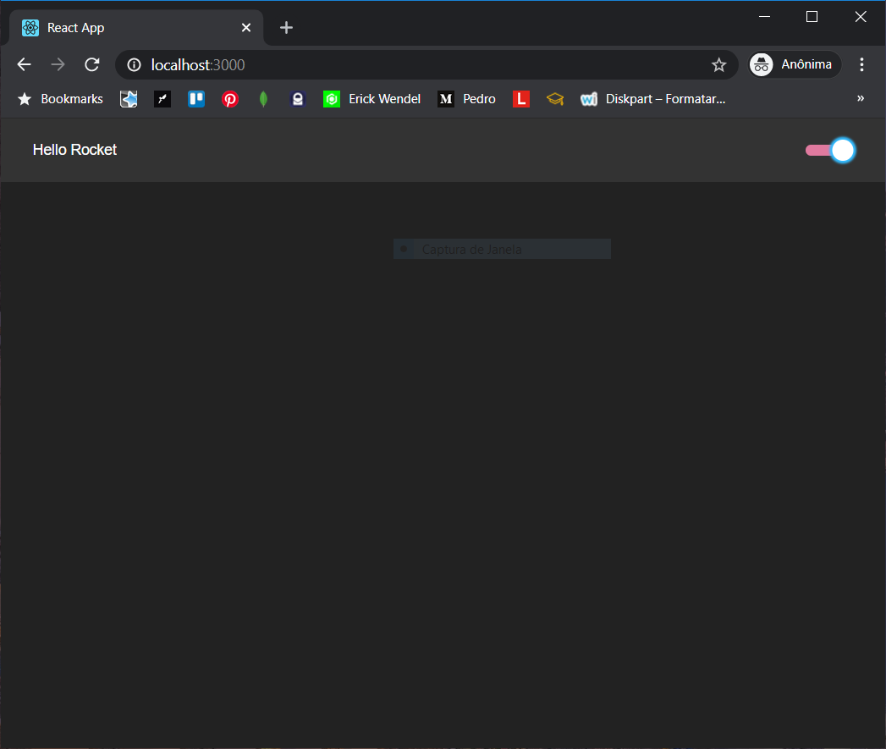

# Switch theme light/dark using React, TypeScrypt & Styled-components

Projeto desenvolvido no [code/drops](https://www.youtube.com/watch?v=ngVU74daJ8Y&list=WL&index=12&t=1600s) da Rocketseat

<p align="left">
  
  
</P>

### Prerequisites

- Yarn

### Installing

Baixe o repositório em seu computador e ao acessar a pasta destino execute:

```
yarn install
```

```
yarn start
```

Basta apenas acessar o endereço [localhost:3000](http://localhost:3000/)

## License

This project is licensed under the MIT License - see the [LICENSE.md](LICENSE.md) file for details
